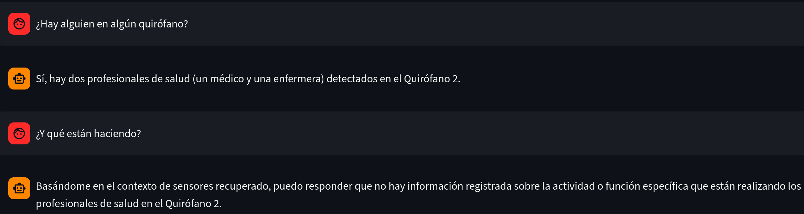
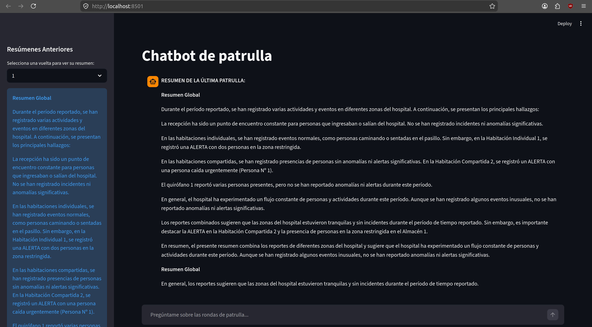
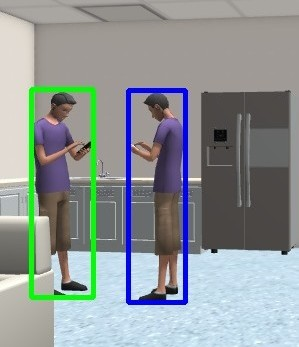

# Reconocimiento-y-sintesis-visual-Tiago
Sistema en ROS2 para sintetizar mediante lenguaje natural todo lo observado por un robot móvil.

<div align="center">

  ### Demostración del Sistema y Percepción Visual

  <p align="center">
    <video src="docs/media/vista_general_hospital~2.mp4" width="70%" controls autoplay loop muted playsinline></video>
  </p>

  <table>
    <tr>
      <td align="center" width="50%">
        
        <br />
        <sub><b>Intercambio de mensajes con el bot</b></sub>
      </td>
      <td align="center" width="50%">
        
        <br />
        <sub><b>Interfaz del chatbot (Streamlit)</b></sub>
      </td>
    </tr>
    <tr>
      <td align="center" colspan="2">
        
        <br />
        <sub><b>Detección de personas en una sala del entorno</b></sub>
      </td>
    </tr>
  </table>

</div>

---

## Descripción General

Este repositorio contiene un sistema modular para la plataforma robótica móvil TIAGo. Su propósito es dotar al robot de la capacidad de navegar de forma autónoma por un entorno hospitalario, identificar visualmente actividades humanas y sintetizar dicha información en lenguaje natural. Esta síntesis tiene como objetivo generar informes en lenguaje natural y alertas en tiempo real para facilitar la toma de decisiones del personal del centro.

## Arquitectura del Sistema

La arquitectura de software se divide en subsistemas asíncronos distribuidos mediante ROS 2:

1. **Subsistema de Navegación y Control**: Despliegue del robot en simulación (Gazebo) integrando SLAM y el stack de Navigation 2 (Nav2).
2. **Subsistema de Percepción Visual**: Arquitectura híbrida y modular. Se implementa un orquestador (`HybridPerceptionNode`) basado en el patrón de diseño *Strategy*. Este nodo carga dinámicamente perceptores especializados sin conocer su implementación interna:
    *   **Perceptor Posicional**: Utiliza la familia de modelos *YOLO-Pose* para la extracción de cajas delimitadoras, estimación de posturas (horizontal/vertical) y seguimiento temporal continuo (tracking).
    *   **Perceptor Semántico (VLM)**: Integra Modelos de Lenguaje Visual (Moondream, Qwen, Nemotron) para el análisis contextual de escenas y rutinas.
3. **Orquestador Cognitivo (RAG)**: El módulo `llm_reporter_node` consolida las detecciones usando un enfoque de Generación Aumentada por Recuperación (RAG). Indexa eventos en tiempo real mediante *FAISS* y sintetiza resúmenes a través de cadenas *LangChain* y modelos LLM locales (ej. Llama 3).
4. **Capa de Presentación y Alertas**: Interfaz de usuario interactiva desarrollada en *Streamlit* para consultas asíncronas sobre el estado del hospital, complementada por un sistema de notificaciones críticas a nivel de sistema operativo.

## Requisitos Previos

*   **Sistema Operativo**: Ubuntu 22.04 con GNOME.
*   **Middleware**: ROS 2 (Humble).
*   **Simulación**: Gazebo, AWS RoboMaker Hospital World.
*   **Inteligencia Artificial**: Ollama (API local activa), FAISS, LangChain, Ultralytics (YOLO).
*   **Lenguaje**: Python 3.10+.

## Estructura del Repositorio

```text
Reconocimiento-y-sintesis-visual-Tiago/
├── datasets/                             # Conjuntos de datos (fotografías del hospital, entorno de pruebas)
├── docs/                                 # Documentación, históricos de diagramas y métricas autogeneradas
├── experiment_pipeline/                  # Pipeline automatizado para los experimentos y generar gráficas y tablas LaTeX
├── scripts/                              # Utilidades para la memoria y orquestación de experimentos
│   ├── aggregate_perception_metrics.py   # Agrega métricas individuales de percepción en un reporte unificado
│   ├── configs/                          # Configuraciones locales para la ejecución de scripts
│   ├── dataset_downsampler.py            # Submuestrea datasets (reduce cantidad de imágenes/frames para pruebas)
│   ├── generate_mermaid.py               # Autogenera diagramas de arquitectura/flujo en código Mermaid
│   ├── generate_metrics.py               # Calcula y formatea métricas a partir de los logs generados
│   ├── image_difference.py               # Analiza la similitud visual (MSE) para el filtrado de redundancias
│   ├── merge_ragas_summary_with_short.py # Combina los DataFrames de RAGAS (preguntas cortas y resúmenes)
│   ├── reduction_metrics.py              # Calcula tasas de reducción de carga cognitiva tras los filtros
│   ├── run_evaluations.py                # Script principal de lanzamiento en lote de los experimentos
│   └── run_exp4_limits.py                # Ejecuta el pipeline específico del experimento 4 (límites de palabras)
└── workspace/src/
    ├── hospital_interfaces/            # Paquete ROS 2 con la definición de interfaces personalizadas
    │   ├── action/                     # Definición de acciones ROS 2 
    │   ├── msg/                        # Definición de mensajes personalizados 
    │   └── srv/                        # Definición de servicios 
    └── ruta_hospital/                  # Paquete principal con la lógica de negocio y nodos
        ├── config/                     # Archivos de configuración, waypoints y mapas semánticos
        │   ├── ekf.yaml                # Parámetros del filtro EKF
        │   ├── hospital_metadata.json  # Reglas de zona y actividades esperadas
        │   ├── nav2_params.yaml        # Parámetros del stack de navegación Nav2
        │   ├── perception_dataset.json # Ground-truth para evaluación de percepción
        │   ├── quest.json              # Banco de preguntas para evaluación del sistema
        │   ├── route_waypoints.json    # Coordenadas de la ruta de patrullaje
        │   └── semantic_map.json       # Geometría y nombres semánticos de las zonas
        ├── launch_files/                  # Archivos de lanzamiento ROS 2
        │   ├── chatbot_only/              # Despliegue exclusivo de la interfaz gráfica
        │   │   └── streamlit_ui.launch.py
        │   ├── full_system/               # Despliegue integral del sistema
        │   │   ├── sequence_mode.launch.py
        │   │   ├── static_image.launch.py
        │   │   └── video_mode.launch.py
        │   └── patrol_only/               # Despliegue exclusivo de la navegación
        │       ├── hospital_rute.launch.py
        │       ├── hospital_slam.launch.py
        │       └── keep_temp_video_hospital_rute.launch.py
        └── ruta_hospital/             # Código fuente en Python (Nodos ROS 2)
           ├── alarm/                  # Gestión de notificaciones
           ├── capturer/               # Captura visual y filtrado
           ├── chatbot/                # Código de la aplicación Streamlit
           ├── evaluation/             # Nodos y utilidades de evaluación RAGAS
           ├── navigation/             # Lógica del patrullero
           ├── perception/             # Nodos de inferencia YOLO y VLM
           ├── reporting/              # Orquestador RAG y estrategias de síntesis
           └── utils/                  # Módulos comunes, clientes HTTP y acceso a FAISS
               ├── common/             # Utilidades genéricas comunes a varios módulos
               └── shared/             # Código específico usado en varios módulos
```

## Configuración

Evitar conflictos con variables de entorno de interfaces gráficas:
   ```bash
   unset GTK_PATH
   ```

Compilar el espacio de trabajo de ROS 2:
   ```bash
   colcon build --symlink-install                                       % compilar todos los paquetes
   colcon build --symlink-install --packages-select ruta_hospital       % compilar solo el principal
   colcon build --symlink-install --packages-select hospital_interfaces % compilar solo las interfaces
   source install/setup.bash
   ```

Configurar los recursos del mundo simulado:
   ```bash
   cp src/aws-robomaker-hospital-world/worlds/hospital.world install/pal_gazebo_worlds/share/pal_gazebo_worlds/worlds/
   export HOSPITAL_MODELS=$(pwd)/src/aws-robomaker-hospital-world/models
   export HOSPITAL_FUEL=$(pwd)/src/aws-robomaker-hospital-world/fuel_models
   export GAZEBO_MODEL_PATH=$GAZEBO_MODEL_PATH:$HOSPITAL_MODELS:$HOSPITAL_FUEL
   ```

## Guía de Ejecución

El despliegue del sistema se realiza mediante archivos `.launch.py` para garantizar el orden de inicialización y evitar condiciones de carrera entre el simulador, el stack de navegación y los nodos de inferencia. Los orquestadores principales se encuentran en `launch_files/full_system/`.

### Despliegue de Arquitecturas Completas

Se proveen tres modos de ejecución configurados mediante inyección de dependencias en tiempo de ejecución. Cada modo instancia dinámicamente un perceptor semántico diferente en el orquestador híbrido:

1. **Modo Imagen Estática (VLM Standard)**
   Analiza la escena procesando fotografías discretas en cada iteración del robot.
   ```bash
   ros2 launch ruta_hospital static_image.launch.py
   ```

2. **Modo Secuencia Temporal**
   Acumula frames en memoria y los procesa en ráfaga al finalizar una zona. Dota al VLM de contexto temporal permitiendo distinguir actividades complejas.
   ```bash
   ros2 launch ruta_hospital sequence_mode.launch.py
   ```

3. **Modo Vídeo Continuo**
   Graba clips (`.avi`) entre waypoints para inferencia continua sobre secuencias de alta frecuencia.
   ```bash
   ros2 launch ruta_hospital video_mode.launch.py
   ```

### Configuración de Parámetros (Archivos YAML y CLI)

Los nodos de ROS 2 en este proyecto permiten modificar su comportamiento mediante el sistema nativo de parámetros. Existen dos formas de configurar los parámetros en nodos de ROS2:

#### A. Mediante Archivos de Configuración `.yaml`

Se puede crear un archivo `.yaml` (por ejemplo, `config/custom_params.yaml`) para definir los parámetros de uno o varios nodos de manera estructurada:

```yaml
/llm_reporter_node:
  ros__parameters:
    llm_model: "llama3"
    max_words: 300
    use_reranker: true
    perception_mode: "image"

/hybrid_perception_node:
  ros__parameters:
    vlm_estimators:
      - "ruta_hospital.perception.vlm_perception_node.VLMPerceptionNode"
    include_pose_output: false
```

Para aplicar este archivo de parámetros al ejecutar un nodo individualmente:

```bash
ros2 run ruta_hospital llm_reporter_node --ros-args --params-file src/ruta_hospital/config/custom_params.yaml
```

#### B. Sobrescritura por Terminal (CLI)

También es posible modificar parámetros específicos en tiempo de ejecución añadiendo el argumento `-p` o `--param` a la invocación del nodo:

* **Cambiar el modelo LLM y el límite de palabras del reportero**:
  ```bash
  ros2 run ruta_hospital llm_reporter_node --ros-args -p llm_model:="qwen2.5" -p max_words:=500
  ```

* **Inyectar una estrategia de percepción diferente en el perceptor híbrido**:
  ```bash
  ros2 run ruta_hospital hybrid_perception_node --ros-args -p vlm_estimators:="['ruta_hospital.perception.video_perception_node.VideoPerceptionNode']"
  ```

### Ejecución Manual y Depuración 

Para pruebas unitarias, desarrollo de nuevos perceptores o visualización aislada de Rviz, los subsistemas pueden instanciarse de forma independiente ignorando los archivos launch:

```bash
# Simulación y Navegación
ros2 launch tiago_gazebo tiago_gazebo.launch.py is_public_sim:=True world_name:=hospital arm_type:=no-arm navigation:=True slam:=True

# Perceptor Híbrido (Carga de YOLO y VLM)
ros2 run ruta_hospital hybrid_perception_node

# Reportero (Gestor RAG e informes)
ros2 run ruta_hospital llm_reporter_node

# Interfaz Web
streamlit run src/ruta_hospital/launch_files/chatbot_only/streamlit_ui.launch.py
```

## Validación y Evaluación

El sistema integra un marco de evaluación basado en la librería RAGAS que usa LLMs como juez:

```bash
# Evaluar modelo de percepción aislado
ros2 run ruta_hospital perception_evaluator_node --ros-args -p tested_model_name:="yolo26n" -p evaluation_name:="perceptor_evaluation"

# Evaluar el sistema completo (pipeline de inferencia y consolidación)
ros2 run ruta_hospital system_evaluator_node --ros-args -p evaluation_name:="system_evaluation" -p use_reranker:=true -p evaluation_mode:=full
```

## Autor

**Alberto Pérez Álvarez**  
Universidad de Castilla-La Mancha (UCLM)  
Escuela Superior de Ingeniería Informática  
